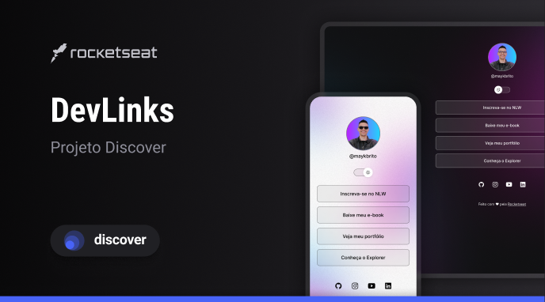

O projeto do DevLinks é um agregador de links do instrutor Mayk Brito realizado como exercício de aula como aprendizado de técnicas para programação web.

Linguagens empregadas:

HTML

CSS

JavaScript

O projeto pode ser acessado através deste <a href="https://www.figma.com/design/XqFhMhAfsdnm2vvWg034In/DevLinks-•-Projeto-Discover-(Community)?node-id=10-620&t=I4Jmaq6wzbqeevIS-0">link</a>.

